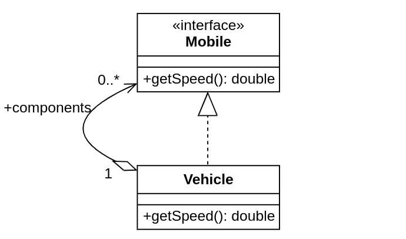
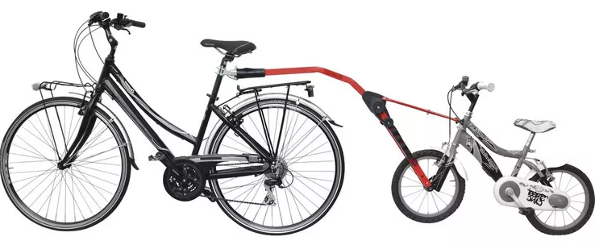

# Simulation de Vélo
Dans ce TP, vous réalisez des exercices sur les **patrons de conception**[^1] à l'aide d'une application simple qui simule, d'une manière très approximative, le fonctionnement d'un vélo.   

## Modalité
* Ces travaux pratiques sont notés.
* Ils sont à réaliser en binôme.
* Le compte rendu à remplir se trouve [ici](Rapport.md).

## Véhicule et ses composants
Dans notre simulation, comme dans la vie réelle, un véhicule a une vitesse, ainsi que tous ses composants.
La vitesse du véhicule est calculée en fonction de la vitesse moyenne de tous ses composants.

Observez le diagramme de classe partiel suivant qui représente les relations entre les types `Mobile` et `Vehicle`.

> **Exercise 1** 
>
> Quel patron de conception reflète ce modèle ? Identifiez le rôle de chaque de ces deux classes dans ce patron.
> 
> Réalisez la classe `TagAlongBike` qui représente un vélo parental traînant un vélo d'enfant (voir image).
> Le vélo parental est un vélo qui contient dans ses composants un autre vélo simple.
> Doit-on récrire la méthode `getSpeed()` pour la nouvelle classe ?

## Parcours des composants
Dans la méthode `getSpeed()` de la classe `Vehicule` on parcourt tous les composants d'un véhicule pour calculer la vitesse moyenne.

> **Exercise 2**
>
> Quel patron de conception utilise la méthode `getSpeed()` pour parcourir les composants d'un véhicule ? 
> Quel avantage apporte ce patron ?
> 
> Modifier la structure de donnée utilisée pour stocker les composants d'un véhicule de `Set` à `List`.
> Doit-on modifier la réalisation de la méthode `getSpeed()` ?

## Problème de synchronisation
Le calcul de vitesse de la roue depends de l'effort (fourni par méthode `getPush()`) et la résistance de terrain, indiquée par la méthode `getResistanceFactor()` de la classe `Terrain`. 
À l'état actuel, le calcul de vitesse montre un avertissement dans les journaux d'événements[^2].
En regardant le message affiché à la sortie standard, on voit que les composants du vélo ne sont pas synchronisés.

Chaque roue a sa propre instance de `Terrain`, ce qui fait que la résistance varie pour chaque roue.
On n'obtient donc pas une vitesse homogène, ce qui est une source de danger.
D'où le message d'avertissement. 

Dans la vie réelle on n'a pas ce problème-là, car les deux roues roulent sur le même terrain.
Il faut donc veiller à ce que les deux roues dans notre simulation roulent, eux aussi, sur un et même terrain.

> **Exercise 3**
> 
> Utilisez le patron de conception de création *singleton* pour assurer qu'il n'y a qu'une seule instance de la classe `Terrain` dans l'application.
> Les deux roues doivent donc utiliser cette même instance et le message d'avertissement doit disparaitre.
> 
> Expliquez, en quelques lignes, les étapes de la réalisation de ce patron dans le code.
> 
> Attention, seulement une seule instance doit être instantiable de la classe `Terrain`.

## Roue vélo, vélo roue
Observez les classes `Bike` et `Wheel`.
À l'état actuel, un vélo a des références à ses roues.
Une roue a une référence au vélo pour obtenir l'effort appliqué, nécessaire pour le calcul de sa vitesse.     

> **Exercise 4**
> 
> Les classes `Bike` et `Wheel`, appartiennent-elles à deux paquetages[^3] différents ?
> Quel type de dépendance y a-t-il entre les deux classes ?
> Cette dépendance adhère-t-elle aux bonnes pratiques de conception ?
>
> Quelle fonctionnalité de la classe `Bike` utilise la classe `Wheel` ?
> Y a-t-il une abstraction dans le code proposé qui expose cette fonctionnalité ?
> 
> Proposez, et réalisez, une solution pour casser la dépendance cyclique entre les classes `Bike` et `Wheel`.

## Journaux nommés
Pour tracer les sources des messages dans les journaux, on utilise des journaux nommés, représentés par la classe `NamedLogger` dans notre code.
`FileLogger` et `ConsoleLogger` sont deux classes qui héritent de `NamedLogger`.

Leurs méthodes `log()` partagent une étape commune : la fabrication du message du journal à partir de nom du journal, format et arguments du message.
Cette fonctionnalité commune se matérialise avec un code en doublon à l'état actuel.

> **Exercise 5**
> 
> Proposez un patron de conception qui permet de centraliser cette étape commune à un seul endroit et d'éviter le code en doublon.
> 
> Modifiez la classe `NamedLogger` et ses sous-classes pour réaliser ce patron.

## Journaux centralisés
Les journaux d'événements sont utilisés à deux endroits dans notre code : la classe `Bike` et la classe `BikeSimulator`.
Malheureusement, chacune de ces deux classes utilise une réalisation différente de l'interface `Logger`.
Pour lire tous les messages des journaux, on est obligés de regarder et dans la sortie standard et dans le fichier `log.txt`.

On voudrait donc centraliser le choix de la réalisation de l'interface `Logger` à un seul endroit. 

> **Exercise 6**
> 
> Utiliser le patron de conceptions **méthode de fabrique** pour centraliser le choix de réalisation de l'interface `Logger`.
> 
> C'est quoi la difference entre cette méthode et le patron singleton ?

## Injection de dépendance
On souhaite lancer la simulation de vélo soit avec un vélo simple (classe `Bike`), soit avec un vélo parental (classe `TagAlongBike`).

Pour ce faire, on utilise le principe d'injection de dépendance.
Cela implique que le code client n'instancie pas directement les objects dont il a besoin, mais c'est le contexte de l'application qui les injecte.
Il suffit donc que le code applicatif déclare son besoin.

L'édition standard de Java (Jave SE) fournit un outil simple pour l'injection de dépendance, matérialisé par la classe [ServiceLoader](https://docs.oracle.com/javase/8/docs/api/java/util/ServiceLoader.html).
La classe `Context` dans le code propose une interface simplifiée de `ServiceLoader`, avec un ensemble restreint de ses fonctionnalités.

Observez le fichier `fr.polytech.sim.cycling.Bike` dans le dossier `src/resources/META-INF/services` qui sert à définir quelles sous-classes il faut injecter quand un vélo (un objet de type `Bike`) est attendu par l'application.

> **Exercice 7**
> 
> Quel patron de conception suit la classe `Context` vis-à-vis l'outil `ServiceLoader` ? 
> 
> Utilisez la classe utilitaire `Context` pour injecter un objet de type `Bike` dans la simulation, au lieu de l'instancier avec le mot clef `new`.
> Changez la classe injectée de `Bike` à `TagAlongBike`.
> 
> Peut-on avoir plusieurs lignes dans le fichier `fr.polytech.sim.cycling.Bike` ?
> À quoi correspond chaque de ces lignes ?

On souhaite maintenant que notre application puisse simuler plusieurs vélos.

Notez que l'outil `ServiceLoader` supporte l'injection de plusieurs objets.
La méthode souche `injectAll()` de la classe `Context` a pour objectif d'injecter plusieurs objets d'un type donné, si cela a été correctement configuré. 

> **Exercice 8**
> 
> Observez le type de retour de la méthode `injectAll()`.
> Quel patron de conception propose cette méthode pour parcourir tous les objets d'un type donné disponibles dans le contexte applicatif ?
> 
> Réaliser cette méthode en cohérence avec son objectif décrit ci-dessus et détaillé dans sa documentation.
> 
> Modifiez la simulation de vélo pour utiliser cette même méthode afin de simuler tous les types de vélo proposés par la configuration.
> Modifiez la configuration pour simuler et `Bike` et `TagAlongBike`.
> 

[^1]: *Design Patters* en anglais.
[^2]: *Logs* en anglais.
[^3]: *Package* en anglais.

